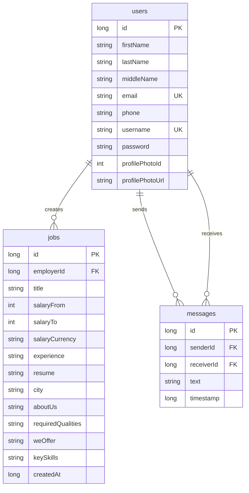
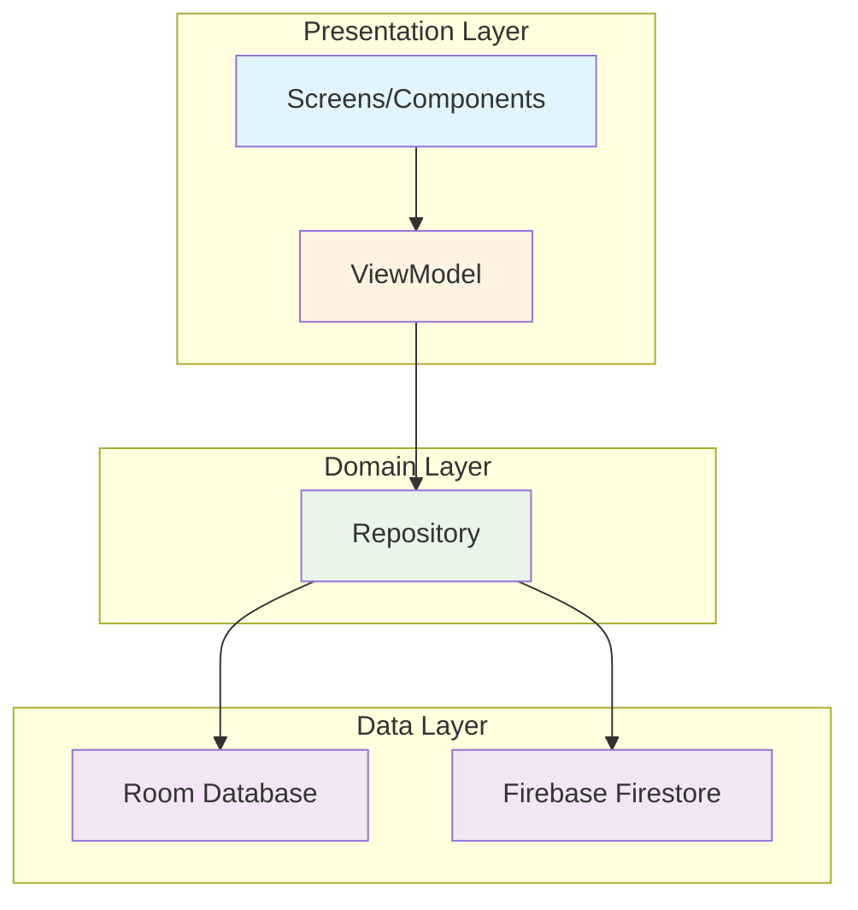
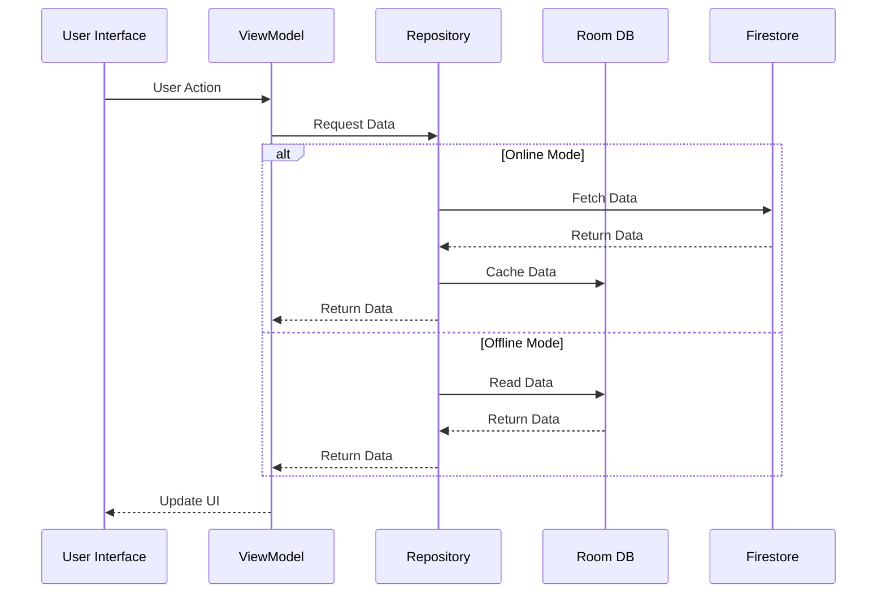
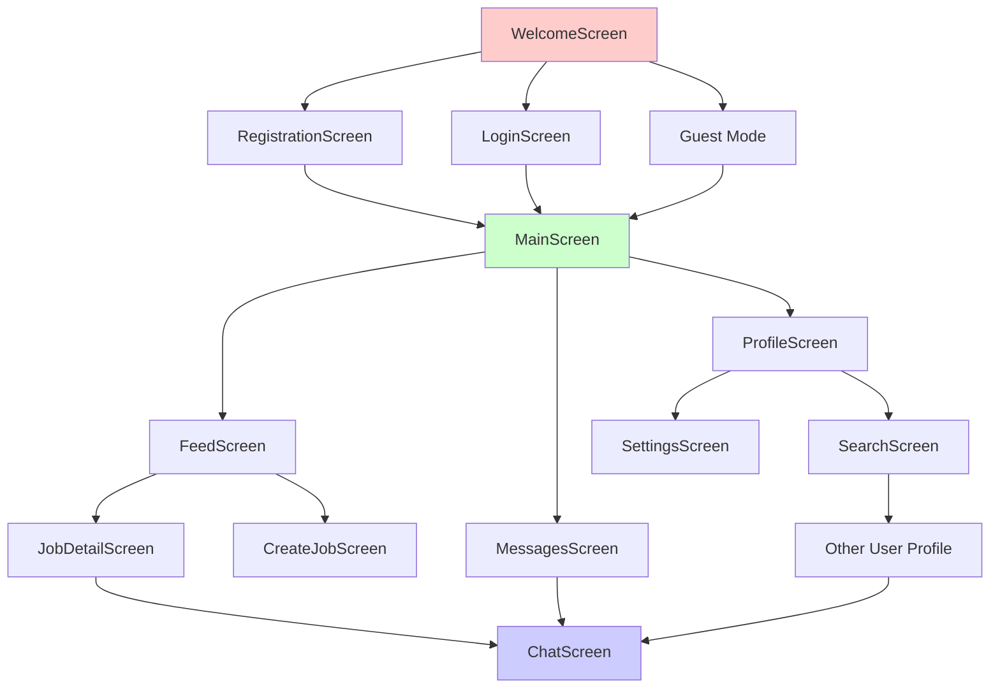

# Архитектура приложения LinkJob

## 1. Общая архитектура (MVVM)

```
┌─────────────────────────────────────────────────────────────┐
│                      Presentation Layer                      │
│  ┌──────────────┐  ┌──────────────┐  ┌──────────────┐      │
│  │   Screens    │  │  Components  │  │  Navigation  │      │
│  │ (Composable) │  │ (Composable) │  │   (NavGraph) │      │
│  └──────┬───────┘  └──────┬───────┘  └──────┬───────┘      │
│         │                 │                 │               │
│         └─────────────────┼─────────────────┘               │
│                           │                                 │
│                  ┌────────▼────────┐                        │
│                  │    ViewModel    │                        │
│                  │  (StateFlow)    │                        │
│                  └────────┬────────┘                        │
└───────────────────────────┼─────────────────────────────────┘
                            │
┌───────────────────────────▼─────────────────────────────────┐
│                      Domain Layer                           │
│                  ┌──────────────┐                          │
│                  │  Repository  │                          │
│                  │   Pattern    │                          │
│                  └──────┬───────┘                          │
└─────────────────────────┼───────────────────────────────────┘
                          │
┌─────────────────────────▼───────────────────────────────────┐
│                       Data Layer                             │
│  ┌──────────────┐  ┌──────────────┐  ┌──────────────┐    │
│  │  Room (DAO)  │  │  Firestore    │  │   Network    │    │
│  │   (Local)    │  │   (Cloud)     │  │    Utils     │    │
│  └──────────────┘  └───────────────┘  └──────────────┘    │
└─────────────────────────────────────────────────────────────┘
```

## 2. Слои приложения

### 2.1. Presentation Layer (UI)

**Структура:**
```
ui/
├── screens/          # Экраны приложения
│   ├── WelcomeScreen.kt
│   ├── LoginScreen.kt
│   ├── RegistrationScreen.kt
│   ├── MainScreen.kt
│   ├── FeedScreen.kt
│   ├── JobDetailScreen.kt
│   ├── CreateJobScreen.kt
│   ├── EditJobScreen.kt
│   ├── MyJobsScreen.kt
│   ├── ProfileScreen.kt
│   ├── SearchScreen.kt
│   ├── MessagesScreen.kt
│   ├── ChatScreen.kt
│   └── SettingsScreen.kt
├── components/        # Переиспользуемые компоненты
│   ├── ProfilePhoto.kt
│   └── TelegramComponents.kt
└── theme/            # Тема приложения
    ├── Color.kt
    ├── Theme.kt
    └── Type.kt
```

**Поток данных:**
```
Screen (Composable)
    ↓ (вызов функции)
ViewModel
    ↓ (StateFlow)
Repository
    ↓ (suspend fun / Flow)
Data Source (Room/Firestore)
```

### 2.2. Domain Layer (Бизнес-логика)

**Структура:**
```
repository/
├── UserRepository.kt      # Работа с пользователями
├── JobRepository.kt        # Работа с вакансиями
└── MessageRepository.kt   # Работа с сообщениями
```

**Паттерн Repository:**
- Единая точка доступа к данным
- Абстракция над источниками данных
- Автоматическая синхронизация Room ↔ Firestore

### 2.3. Data Layer (Данные)

**Структура:**
```
data/
├── AppDatabase.kt     # Room Database
├── User.kt            # Entity
├── UserDao.kt         # Data Access Object
├── Job.kt             # Entity
├── JobDao.kt          # Data Access Object
├── Message.kt         # Entity
└── MessageDao.kt      # Data Access Object
```

## 3. Схема базы данных (ER-диаграмма)

### 3.1. Структура таблиц

```
┌─────────────────────────────────────────────────────────────┐
│                         users                                 │
├─────────────────────────────────────────────────────────────┤
│ PK │ id              │ INTEGER (AUTO_INCREMENT)              │
│    │ firstName       │ TEXT NOT NULL                         │
│    │ lastName        │ TEXT NOT NULL                         │
│    │ middleName      │ TEXT                                  │
│    │ email           │ TEXT NOT NULL                         │
│    │ phone           │ TEXT NOT NULL                         │
│    │ username        │ TEXT NOT NULL                         │
│    │ password        │ TEXT NOT NULL                         │
│    │ profilePhotoId  │ INTEGER (0-6)                         │
│    │ profilePhotoUrl │ TEXT (nullable)                        │
└─────────────────────────────────────────────────────────────┘
                            │
                            │ 1:N
                            │
┌───────────────────────────▼───────────────────────────────────┐
│                         jobs                                  │
├───────────────────────────────────────────────────────────────┤
│ PK │ id              │ INTEGER (AUTO_INCREMENT)              │
│ FK │ employerId      │ INTEGER → users.id                    │
│    │ title           │ TEXT NOT NULL                          │
│    │ salaryFrom      │ INTEGER                                │
│    │ salaryTo        │ INTEGER                                │
│    │ salaryCurrency  │ TEXT (default: "руб.")                │
│    │ experience      │ TEXT NOT NULL                          │
│    │ resume          │ TEXT NOT NULL                          │
│    │ city            │ TEXT NOT NULL                          │
│    │ aboutUs         │ TEXT NOT NULL                          │
│    │ requiredQualities│ TEXT NOT NULL                         │
│    │ weOffer         │ TEXT NOT NULL                          │
│    │ keySkills       │ TEXT NOT NULL                          │
│    │ createdAt       │ INTEGER (timestamp)                    │
└───────────────────────────────────────────────────────────────┘

┌─────────────────────────────────────────────────────────────┐
│                        messages                               │
├─────────────────────────────────────────────────────────────┤
│ PK │ id              │ INTEGER (AUTO_INCREMENT)              │
│ FK │ senderId        │ INTEGER → users.id                     │
│ FK │ receiverId      │ INTEGER → users.id                     │
│    │ text            │ TEXT NOT NULL                         │
│    │ timestamp       │ INTEGER (timestamp)                   │
└─────────────────────────────────────────────────────────────┘
```

### 3.2. Связи между таблицами

```
users (1) ──────< (N) jobs
  │                    │
  │                    │ employerId
  │                    │
  │                    └─> Связь: один пользователь может создать
  │                           множество вакансий
  │
  │ (1) ──────< (N) messages (как отправитель)
  │                    │
  │                    │ senderId
  │
  │ (1) ──────< (N) messages (как получатель)
  │                    │
  │                    │ receiverId
  │
  └─> Связь: пользователь может отправлять и получать
             множество сообщений
```

### 3.3. Индексы и ограничения

**Индексы:**
- `users.email` - уникальный (проверка в коде)
- `users.username` - уникальный (проверка в коде)
- `jobs.employerId` - для быстрого поиска вакансий работодателя
- `jobs.createdAt` - для сортировки по дате
- `messages.senderId`, `messages.receiverId` - для поиска переписок
- `messages.timestamp` - для сортировки сообщений

**Ограничения:**
- `users.email` - должен быть уникальным (валидация в Repository)
- `users.username` - должен быть уникальным (валидация в Repository)
- `jobs.employerId` - внешний ключ на `users.id` (логическая связь)

## 4. Схема синхронизации данных

### 4.1. Онлайн режим

```
┌─────────────┐
│   Firestore │ (Cloud Database)
│  (Primary)  │
└──────┬──────┘
       │
       │ 1. Запрос данных
       │
┌──────▼──────────────────────────────────────┐
│         Repository                           │
│  ┌──────────────────────────────────────┐  │
│  │  if (isOnline()) {                    │  │
│  │      fetch from Firestore             │  │
│  │      save to Room (cache)             │  │
│  │      return data                      │  │
│  │  }                                    │  │
│  └──────────────────────────────────────┘  │
└──────┬──────────────────────────────────────┘
       │
       │ 2. Кэширование
       │
┌──────▼──────┐
│    Room     │ (Local Database)
│   (Cache)   │
└─────────────┘
```

### 4.2. Офлайн режим

```
┌─────────────┐
│    Room     │ (Local Database)
│  (Primary)  │
└──────┬──────┘
       │
       │ 1. Чтение из локальной БД
       │
┌──────▼──────────────────────────────────────┐
│         Repository                           │
│  ┌──────────────────────────────────────┐  │
│  │  if (!isOnline()) {                  │  │
│  │      read from Room                   │  │
│  │      return data                      │  │
│  │  }                                    │  │
│  └──────────────────────────────────────┘  │
└─────────────────────────────────────────────┘
```

### 4.3. Запись данных

```
┌─────────────────────────────────────────────┐
│              User Action                    │
│  (Create/Update/Delete)                     │
└──────────────┬──────────────────────────────┘
               │
               ▼
┌─────────────────────────────────────────────┐
│            ViewModel                         │
│  (обработка UI событий)                      │
└──────────────┬──────────────────────────────┘
               │
               ▼
┌─────────────────────────────────────────────┐
│          Repository                          │
│  ┌──────────────────────────────────────┐  │
│  │  1. Сохранить в Room (локально)      │  │
│  │  2. if (isOnline()) {               │  │
│  │         Синхронизировать с Firestore │  │
│  │     }                                │  │
│  └──────────────────────────────────────┘  │
└──────┬───────────────────────────────────────┘
       │
       ├──────────────┐
       │              │
       ▼              ▼
┌──────────┐    ┌─────────────┐
│   Room   │    │  Firestore   │
│ (Local)  │    │   (Cloud)    │
└──────────┘    └─────────────┘
```

## 5. Поток навигации

```
WelcomeScreen
    ├─> RegistrationScreen ──> MainScreen
    ├─> LoginScreen ──────────> MainScreen
    └─> Guest Mode ───────────> MainScreen

MainScreen (Bottom Navigation)
    ├─> FeedScreen
    │   ├─> JobDetailScreen
    │   │   └─> ChatScreen (если нажать "Написать")
    │   └─> CreateJobScreen (FAB)
    │
    ├─> MessagesScreen
    │   └─> ChatScreen
    │
    ├─> ProfileScreen
    │   ├─> SettingsScreen
    │   └─> EditProfile (встроено)
    │
    └─> SearchScreen (из ProfileScreen)
        └─> ProfileScreen (другого пользователя)
            └─> ChatScreen
```

## 6. Компоненты и зависимости

### 6.1. ViewModel Factory Pattern

```
ViewModelFactory
    ├─> AuthViewModelFactory
    ├─> JobsViewModelFactory
    ├─> MessagesViewModelFactory
    └─> SearchViewModelFactory
```

**Зависимости:**
- Repository
- Context (для SessionManager, NetworkUtils)
- CoroutineScope (viewModelScope)

### 6.2. Утилиты

```
util/
├── SessionManager.kt          # Управление сессией пользователя
├── NetworkUtils.kt             # Проверка интернет-соединения
├── NotificationManager.kt      # Локальные уведомления
├── MessageNotificationScheduler.kt  # Планировщик уведомлений
├── ThemeManager.kt             # Управление темой (светлая/тёмная)
├── Validation.kt               # Валидация данных
└── ProfilePhotoUtils.kt        # Утилиты для фото профиля
```

### 6.3. Фоновые задачи

```
worker/
└── MessageCheckWorker.kt       # WorkManager - периодическая проверка новых сообщений
```

## 7. Технологический стек

```
┌─────────────────────────────────────────┐
│         UI Framework                    │
│    Jetpack Compose + Material 3        │
└─────────────────────────────────────────┘
                    │
┌───────────────────▼────────────────────┐
│      Architecture Components            │
│  ┌──────────────────────────────────┐  │
│  │ ViewModel (StateFlow)            │  │
│  │ Navigation Compose                │  │
│  │ Room Database                     │  │
│  │ WorkManager                       │  │
│  └──────────────────────────────────┘  │
└───────────────────┬────────────────────┘
                    │
┌───────────────────▼────────────────────┐
│         Backend Services                 │
│  ┌──────────────────────────────────┐  │
│  │ Firebase Firestore               │  │
│  │ Firebase Authentication          │  │
│  │ Firebase Storage (для фото)      │  │
│  └──────────────────────────────────┘  │
└─────────────────────────────────────────┘
```

## 8. Потоки данных (Data Flow)

### 8.1. Загрузка списка вакансий

```
FeedScreen
    │
    ▼
JobsViewModel.loadJobs()
    │
    ▼
JobRepository.getAllJobs()
    │
    ├─> Проверка сети
    │
    ├─> [Онлайн] Firestore → Room → StateFlow → UI
    │
    └─> [Офлайн] Room → StateFlow → UI
```

### 8.2. Создание вакансии

```
CreateJobScreen
    │
    ▼
JobsViewModel.createJob()
    │
    ▼
JobRepository.insertJob()
    │
    ├─> Room.insertJob() (локально)
    │
    └─> [Онлайн] Firestore.add() (синхронизация)
```

### 8.3. Отправка сообщения

```
ChatScreen
    │
    ▼
MessagesViewModel.sendMessage()
    │
    ▼
MessageRepository.insertMessage()
    │
    ├─> Room.insertMessage() (локально)
    │
    └─> [Онлайн] Firestore.add() (синхронизация)
```

## 9. Безопасность

### 9.1. Аутентификация
- Пароли хранятся в открытом виде (для демо)
- В продакшене: Firebase Authentication с хешированием

### 9.2. Валидация данных
- Email формат
- Пароль минимальная длина
- Обязательные поля

### 9.3. Сетевая безопасность
- HTTPS для всех запросов к Firebase
- Правила безопасности Firestore (настраиваются в консоли)

## 10. Производительность

### 10.1. Оптимизации
- LazyColumn для списков (ленивая загрузка)
- Flow для реактивных обновлений
- Кэширование в Room
- Debounce для поиска (300ms)

### 10.2. Пагинация
- Планируется для больших списков
- Текущая реализация: загрузка всех данных

## 11. Диаграммы (Mermaid)

### 11.1. ER-диаграмма базы данных



### 11.2. Диаграмма архитектуры MVVM



### 11.3. Диаграмма синхронизации данных



### 11.4. Диаграмма навигации



---

**Версия документа:** 1.0  
**Дата обновления:** 2024  
**Автор:** LinkJob Development Team

